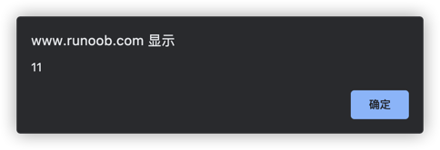

# 输出
<font color=#dea32c>**核心：学习将数据输出到警告框、HTML文档、HTML元素、控制台中。**</font>

| 函数  | 作用   |
|-----|------|
| window.alert() | 警告框  |
| document.write() | HTML文档 |
|innerHTML| HTML元素 |
|console.log()| 控制台  |
***
## window.alert()
```html
<script>
    window.alert(5 + 6);
</script>
```

***
## innerHTML
```html
<h1>我的第一个 Web 页面</h1>

<p id="demo">我的第一个段落</p>

<script>
    // 使用document.getElementById(id)来访问某个HTML元素
    // 使用innerHTML来插入元素内容
    document.getElementById("demo").innerHTML = "段落已修改。";
</script>
```

***
## document.write
可以将JavaScript直接写在HTML文档中：
```html
<h1>我的第一个 Web 页面</h1>

<p>我的第一个段落。</p>

<!-- 这里将会写入document.write(Date())的内容 -->
<script>
    document.write(Date());
</script>
```


> ⚠️ *请使用 document.write() 仅仅向文档输出写内容。
如果在文档已完成加载后执行 document.write，整个 HTML 页面将被覆盖。*
***
## console.log
浏览器中使用 <font color=#dea32c>**F12**</font> 来启用<font color=#dea32c>**调试模式**</font>， 在调试窗口中点击 <font color=#dea32c>**"Console" 菜单**</font>。
```html
<script>
    a = 5;
    b = 6;
    c = a + b;
    console.log(c);
</script>
```
[运行代码](code/输出.html)