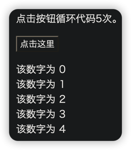
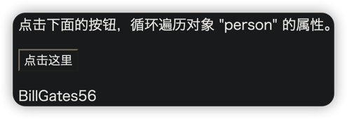
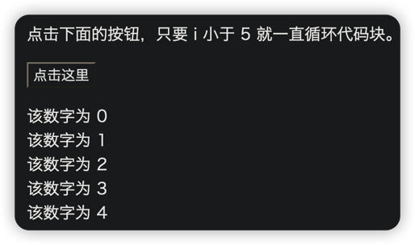
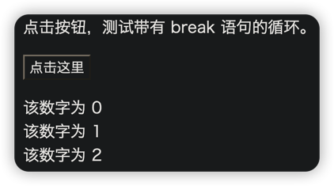
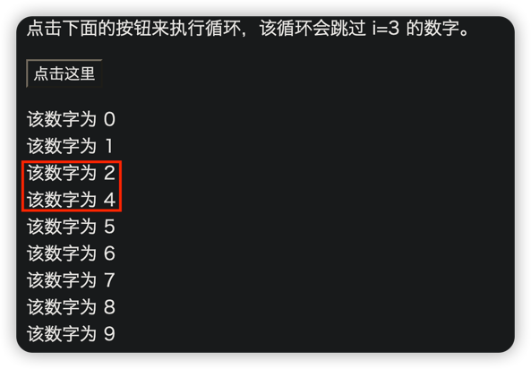
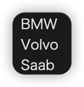

# 循环
***
## For 循环
```html
<p>点击按钮循环代码5次。</p>

<button onclick="myFunction()">点击这里</button>

<p id="demo"></p>

<script>
    function myFunction(){
        var x = "";
        for (var i=0; i<5; i++){
            x = x + "该数字为 " + i + "<br>";
        }
        document.getElementById("demo").innerHTML = x;
    }
</script>
```

***
## For/In 循环
JavaScript for/in 语句循环遍历对象的属性：
```javascript
<p>点击下面的按钮，循环遍历对象 "person" 的属性。</p>

<button onclick="myFunction()">点击这里</button>

<p id="demo"></p>

<script>
function myFunction(){
	var x;
	var txt="";
	var person={fname:"Bill",lname:"Gates",age:56}; 
	for (x in person){
            txt = txt + person[x];
	}
	document.getElementById("demo").innerHTML = txt;
}
</script>
```

***
## while 循环
```javascript
<p>点击下面的按钮，只要 i 小于 5 就一直循环代码块。</p>
<button onclick="myFunction()">点击这里</button>
<p id="demo"></p>
<script>
function myFunction(){
	var x="",i=0;
	while (i<5){
		x=x + "该数字为 " + i + "<br>";
		i++;
	}
	document.getElementById("demo").innerHTML=x;
}
</script>
```

***
## do/while 循环
```javascript
<p>点击下面的按钮，只要 i 小于 5 就一直循环代码块。</p>
<button onclick="myFunction()">点击这里</button>
<p id="demo"></p>
<script>
function myFunction(){
	var x="", i=0;
	do{
	    x=x + "该数字为 " + i + "<br>";
	    i++;
	} while (i<5)  
	document.getElementById("demo").innerHTML=x;
}
</script>
```

***
## break 语句
```javascript
<p>点击按钮，测试带有 break 语句的循环。</p>
<button onclick="myFunction()">点击这里</button>
<p id="demo"></p>
<script>
function myFunction(){
	var x="", i=0;
	for (i=0; i<10; i++){
	    if (i==3){
                break;
            }
            x=x + "该数字为 " + i + "<br>";
        }
	document.getElementById("demo").innerHTML=x;
}
</script>
```

***
## continue 语句
```html
<p>点击下面的按钮来执行循环，该循环会跳过 i=3 的数字。</p>
<button onclick="myFunction()">点击这里</button>
<p id="demo"></p>
<script>
    function myFunction(){
        var x="",i=0;
        for (i=0;i<10;i++){
            if (i==3){
                continue;
            }
            x=x + "该数字为 " + i + "<br>";
        }
        document.getElementById("demo").innerHTML=x;
    }
</script>
```

***
## 标签
continue 语句（带有或不带标签引用）只能用在循环中。

break 语句（不带标签引用），只能用在循环或 switch 中。

通过标<font color=#dea32c>**签引用**</font>，break 语句可用于跳出任何 JavaScript 代码块：
```javascript
cars=["BMW","Volvo","Saab","Ford"];
list:{
	document.write(cars[0] + "<br>"); 
	document.write(cars[1] + "<br>"); 
	document.write(cars[2] + "<br>"); 
	break list;
	document.write(cars[3] + "<br>"); 
	document.write(cars[4] + "<br>"); 
	document.write(cars[5] + "<br>"); 
}
```
