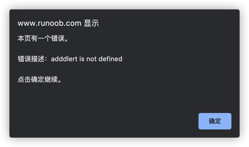
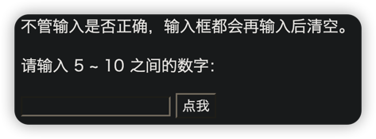

# 错误
<font color=#dea32c>**try**</font> 语句<font color=#dea32c>**测试代码块的错误**</font>。

<font color=#dea32c>**catch**</font> 语句<font color=#dea32c>**处理错误**</font>。

<font color=#dea32c>**throw**</font> 语句创建<font color=#dea32c>**自定义错误**</font>。

<font color=#dea32c>**finally**</font> 语句在 try 和 catch 语句之后，无论是否有触发异常，<font color=#dea32c>**该语句都会执行**</font>。
***
## 语法
```javascript
try {
    ...    //异常的抛出
} catch(e) {
    ...    //异常的捕获与处理
} finally {
    ...    //结束处理
}
```
###📒 实例 
在下面的例子中，我们故意在 try 块的代码中写了一个错字。

catch 块会捕捉到 try 块中的错误，并执行代码来处理它。
```javascript
var txt=""; 
function message() 
{ 
    try { 
        adddlert("Welcome guest!"); 
    } catch(err) { 
        txt="本页有一个错误。\n\n"; 
        txt+="错误描述：" + err.message + "\n\n"; 
        txt+="点击确定继续。\n\n"; 
        alert(txt); 
    } 
}
```

***
## finally 语句
finally 语句不论之前的 try 和 catch 中是否产生异常都会执行该代码块。
### 📒 实例
```javascript
function myFunction() {
  var message, x;
  message = document.getElementById("p01");
  message.innerHTML = "";
  x = document.getElementById("demo").value;
  try { 
    if(x == "") throw "值是空的";
    if(isNaN(x)) throw "值不是一个数字";
    x = Number(x);
    if(x > 10) throw "太大";
    if(x < 5) throw "太小";
  }
  catch(err) {
    message.innerHTML = "错误: " + err + ".";
  }
  finally {
    document.getElementById("demo").value = "";
  }
}
```

***
## Throw 语句
throw 语句允许我们<font color=#dea32c>**创建自定义错误**</font>。

正确的技术术语是：创建或抛出异常（exception）。

如果把 throw 与 try 和 catch 一起使用，那么您能够控制程序流，并生成自定义的错误消息。
```javascript
throw exception
```
异常可以是 JavaScript 字符串、数字、逻辑值或对象。
### 📒 实例
检测输入变量的值。如果值是错误的，会抛出一个异常（错误）。catch 会捕捉到这个错误，并显示一段自定义的错误消息：
```javascript
function myFunction() {
    var message, x;
    message = document.getElementById("message");
    message.innerHTML = "";
    x = document.getElementById("demo").value;
    try { 
        if(x == "")  throw "值为空";
        if(isNaN(x)) throw "不是数字";
        x = Number(x);
        if(x < 5)    throw "太小";
        if(x > 10)   throw "太大";
    }
    catch(err) {
        message.innerHTML = "错误: " + err;
    }
}
```
