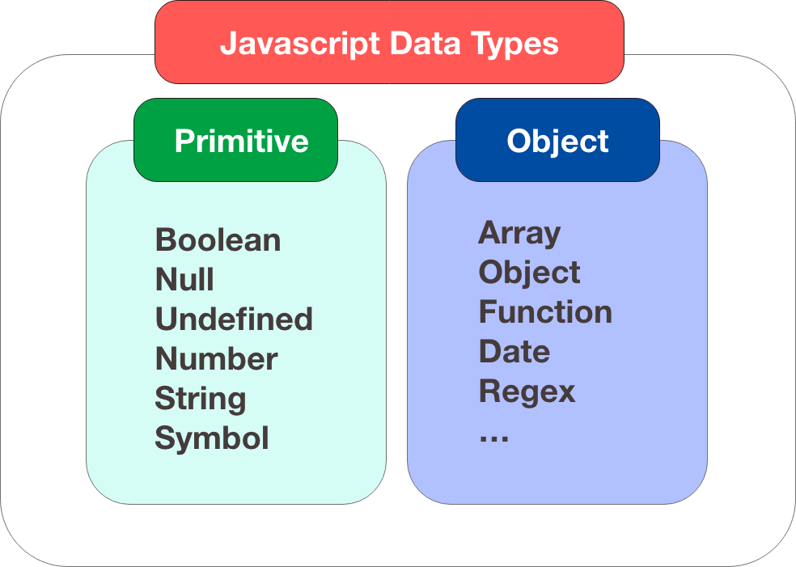

# 数据类型
***
<font color=#dea32c>**值类型(基本类型)**</font>：字符串（String）、数字(Number)、布尔(Boolean)、对空（Null）、未定义（Undefined）、Symbol。

<font color=#dea32c>**引用数据类型（对象类型）**</font>：对象(Object)、数组(Array)、函数(Function)，还有两个特殊的对象：正则（RegExp）和日期（Date）。


> *注：Symbol 是 ES6 引入了一种新的原始数据类型，表示<font color=#dea32c>**独一无二的值**</font>。*
***
## 动态类型
JavaScript 拥有<font color=#dea32c>**动态类型**</font>。这意味着<font color=#dea32c>**相同的变量可用作不同的类型**</font>：
```javascript
var x;               // x 为 undefined
var x = 5;           // 现在 x 为数字
var x = "John";      // 现在 x 为字符串
```
变量的<font color=#dea32c>**数据类型**</font>可以使用 <font color=#dea32c>**typeof**</font> 操作符来查看：
```javascript
typeof "John"                // 返回 string
typeof 3.14                  // 返回 number
typeof false                 // 返回 boolean
typeof [1,2,3,4]             // 返回 object
typeof {name:'John', age:34} // 返回 object
```
***
## 字符串
字符串是存储字符（比如 "Bill Gates"）的变量。

字符串可以是引号中的任意文本。可以使用单引号或双引号：
```javascript
var carname = "Volvo XC60";
var carname = 'Volvo XC60';
```
可以在字符串中使用引号，只要不匹配包围字符串的引号即可：
```javascript
var answer = "It's alright";
var answer = "He is called 'Johnny'";
var answer = 'He is called "Johnny"';
```
***
## 数字
JavaScript <font color=#dea32c>**只有一种数字类型**</font>。数字可以带小数点，也可以不带：
```javascript
var x1 = 34.00;      // 使用小数点来写
var x2 = 34;         // 不使用小数点来写
```
<font color=#dea32c>**极大或极小**</font>的数字可以通过<font color=#dea32c>**科学（指数）计数法**</font>来书写：
```javascript
var y = 123e5;      // 12300000
var z = 123e-5;     // 0.00123
```
***
## 布尔
布尔（逻辑）只能有两个值：<font color=#dea32c>**true**</font> 或 <font color=#dea32c>**false**</font>。
```javascript
var x = true;
var y = false;
```
***
## 数组
```javascript
// 创建数组
// 方式1
var cars = new Array();
// 方式2
var cars = new Array("Saab", "Volvo", "BMW");
// 方式3
var cars = ["Saab", "Volvo", "BMW"];

// 给数组元素赋值
cars[0] = "Saab";
cars[1] = "Volvo";
cars[2] = "BMW";
```
***
## 对象
对象由<font color=#dea32c>**花括号**</font>分隔。在括号内部，对象的属性以名称和值对的形式 (<font color=#dea32c>**name : value**</font>) 来定义。属性由<font color=#dea32c>**逗号分隔**</font>：
```javascript
var person = {firstname:"John", lastname:"Doe", id:5566};
```
空格和折行无关紧要。声明<font color=#dea32c>**可横跨多行**</font>：
```javascript
var person = {
    firstname : "John",
    lastname  : "Doe",
    id        :  5566
};
```
对象属性有<font color=#dea32c>**两种寻址方式**</font>：
```javascript
name = person.lastname;
name = person["lastname"];
```
***
## Undefined 和 Null
<font color=#dea32c>**Undefined**</font> 这个值表示<font color=#dea32c>**变量不含有值**</font>。

可以通过将变量的值<font color=#dea32c>**设置为 null 来清空变量**</font>。
```javascript
cars = null;
person = null;
```
***
## 声明变量类型
当声明新变量时，可以使用关键词 "<font color=#dea32c>**new**</font>" 来声明其类型：
```javascript
var carname = new String;
var x =       new Number;
var y =       new Boolean;
var cars =    new Array;
var person =  new Object;

```
> 💡*JavaScript 变量均为对象。当您声明一个变量时，就创建了一个新的对象。*


