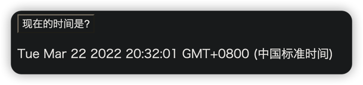
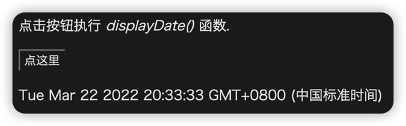

# 事件
HTML 事件是发生在 HTML 元素上的事情。

当在 HTML 页面中使用 JavaScript 时， JavaScript 可以触发这些事件。
***
## HTML 事件
HTML 事件可以是<font color=#dea32c>**浏览器行为**</font>，也可以是<font color=#dea32c>**用户行为**</font>。

以下是 HTML 事件的实例：

* HTML 页面完成加载
* HTML input 字段改变时
* HTML 按钮被点击

通常，当事件发生时，你可以做些事情。

在事件触发时 JavaScript 可以执行一些代码。

HTML 元素中可以添加事件属性，使用 JavaScript 代码来添加 HTML 元素。
```html
<!-- 单引号 -->
<some-HTML-element some-event = 'JavaScript 代码'>
<!-- 双引号 -->
<some-HTML-element some-event = "JavaScript 代码">
```
> 在以下实例中，按钮元素中添加了 onclick 属性 (并加上代码):
```html
<button onclick="getElementById('demo').innerHTML = Date()">
    现在的时间是?
</button>

<p id="demo"></p>
```

> 💡*JavaScript代码通常是几行代码。比较常见的是通过事件属性来调用：*
```html
<p>点击按钮执行 <em>displayDate()</em> 函数.</p>

<button onclick="displayDate()">点这里</button>

<script>
    function displayDate(){
        document.getElementById("demo").innerHTML = Date();
    }
</script>

<p id="demo"></p>
```

***
## 常见的HTML事件
| 事件          | 描述                    |
|-------------|-----------------------|
| onchange    | HTML 元素改变             |
| onclick     | 用户点击 HTML 元素          |
| onmouseover | 鼠标指针移动到指定的元素上时发生      |
| onmouseout  | 用户从一个 HTML 元素上移开鼠标时发生 |
| onkeydown   | 用户按下键盘按键              |
| onload      | 浏览器已完成页面的加载           |