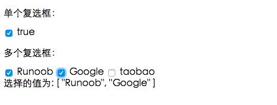
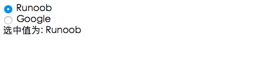

# 表单
用 <font color=#dea32c>**v-model**</font> 指令在表单控件元素上创建<font color=#dea32c>**双向数据绑定**</font>。

v-model 会根据控件类型自动选取正确的方法来更新元素。
***
## 输入框
> 实例中演示了 <font color=#dea32c>**input**</font> 和 <font color=#dea32c>**textarea**</font> 元素中使用 v-model 实现双向数据绑定：
```html
<input v-model="message" placeholder="编辑我……">
<p>{{ message }}</p>

<textarea v-model="message2" placeholder="多行文本输入……"/>
<p>{{ message2 }}</p>
```
```javascript
data: {
    message: 'Runoob',
    message2: 'vue2-菜鸟教程\r\nhttp://www.runoob.com'
}
```
[运行代码](code/表单.html)
***
## 复选框
```html
<!-- 单个复选框 -->
<input v-model="checked">
<label>{{ checked }}</label>

<!-- 多个复选框 -->
<input v-model="checkedNames">
<label>Runoob</label>
<input v-model="checkedNames">
<label>Google</label>
<input v-model="checkedNames">
<label>taobao</label>

<span>选择的值为: {{ checkedNames }}</span>
```
```javascript
data: {
    checked : false,
    checkedNames: []
}
```


[运行代码](code/表单1.html)
***
## 单选按钮
```html
<div id="app">
  <input type="radio" id="runoob" value="Runoob" v-model="picked">
  <label for="runoob">Runoob</label>
  <br>
  <input type="radio" id="google" value="Google" v-model="picked">
  <label for="google">Google</label>
  <br>
  <span>选中值为: {{ picked }}</span>
</div>
 
<script>
new Vue({
  el: '#app',
  data: {
    picked : 'Runoob'
  }
})
</script>
```


[运行代码](code/表单2.html)
***
## 下拉列表
```html
<div id="app">
  <select v-model="selected" name="fruit">
    <option value="">选择一个网站</option>
    <option value="www.runoob.com">Runoob</option>
    <option value="www.google.com">Google</option>
  </select>
 
  <div id="output">
      选择的网站是: {{selected}}
  </div>
</div>
 
<script>
new Vue({
  el: '#app',
  data: {
    selected: '' 
  }
})
</script>
```


[运行代码](code/表单3.html)
***
## 修饰符
#### <font color=#65c294>**.lazy**</font>
在默认情况下， v-model 在 input 事件中同步输入框的值与数据，但你可以添加一个修饰符 lazy ，从而转变为<font color=#dea32c>**在 change 事件中同步**</font>：
```html
<!-- 在 "change" 而不是 "input" 事件中更新 -->
<input v-model.lazy="msg" >
```
#### <font color=#65c294>**.number**</font>
如果想<font color=#dea32c>**自动将用户的输入值转为 Number 类型**</font>（如果原值的转换结果为 NaN 则返回原值），可以添加一个修饰符 number 给 v-model 来处理输入值：
```html
<input v-model.number="age" type="number">
```
这通常很有用，因为在 type="number" 时 HTML 中输入的值也总是会返回字符串类型。
#### <font color=#65c294>**.trim**</font>
如果要自动<font color=#dea32c>**过滤**</font>用户输入的<font color=#dea32c>**首尾空格**</font>，可以添加 trim 修饰符到 v-model 上过滤输入：
```html
<input v-model.trim="msg">
```