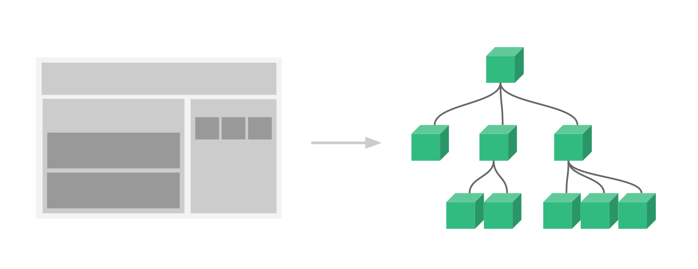

# 组件

1. 简介
2. 注册组件
3. 全局组件
4. 局部组件
5. Prop
6. 动态Prop
7. Prop验证

***
## 简介

<font color=#dea32c>**组件（Component**</font>）是 Vue 最强大的功能之一，类似于Android的自定义View。

可以<font color=#dea32c>**扩展 HTML 元素**</font>，<font color=#dea32c>**封装可重用的代码**</font>。

用独立可复用的小组件来构建大型应用，几乎任意类型的应用的<font color=#dea32c>**界面都可以抽象为一个组件树**</font>：

***
## 注册组件
<font color=#dea32c>**注册**</font>一个<font color=#dea32c>**全局组件**</font>语法格式如下：
```javascript
// tagName 为组件名，options 为配置选项
Vue.component(tagName, options)
```
注册后，我们可以使用以下方式来<font color=#dea32c>**调用组件**</font>：
```html
<tagName></tagName>
```
***
## 全局组件
所有实例都能用全局组件。
> 案例：注册一个简单的全局组件 runoob，并使用它：
```javascript
// 注册
Vue.component('runoob', {
  template: '<h1>自定义组件!</h1>'
})
// 创建根实例
new Vue({
  el: '#app'
})
```
```html
<div id="app">
    <runoob></runoob>
</div>
```
[运行代码](code/全局组件.html)
***
## 局部组件
可以在<font color=#dea32c>**实例选项**</font>中注册局部组件，这样组件只能在这个实例中使用：
> 案例：注册一个简单的局部组件 runoob，并使用它：
```javascript
var Child = {
  template: '<h1>自定义组件!</h1>'
}
 
// 创建根实例
new Vue({
  el: '#app',
  components: {
    // <runoob> 将只在父模板可用
    'runoob': Child
  }
})
```
```html
<div id="app">
    <runoob></runoob>
</div>
```
[运行代码](code/局部组件.html)
***
## Prop
prop 是子组件用来<font color=#dea32c>**接受**</font>父组件传递过来的<font color=#dea32c>**数据**</font>的一个<font color=#dea32c>**自定义属性**</font>。

父组件的数据需要通过 props 把数据传给子组件，子组件需要显式地用 props 选项声明 "prop"：
```html
<div id="app">
    <child message="hello!"></child>
</div>
 
<script>
// 注册
Vue.component('child', {
  // 声明 props
  props: ['message'],
  // 同样也可以在 vm 实例中像 "this.message" 这样使用
  template: '<span>{{ message }}</span>'
})
// 创建根实例
new Vue({
  el: '#app'
})
</script>
```
[运行代码](code/Prop.html)
***
## 动态 Prop
类似于用 v-bind 绑定 HTML 特性到一个表达式，也可以用 v-bind 动态绑定 props 的值到父组件的数据中。<font color=#dea32c>**每当父组件的数据变化时，该变化也会传导给子组件**</font>：
```html
<div id="app">
    <div>
      <input v-model="parentMsg">
      <br>
      <child v-bind:message="parentMsg"></child>
    </div>
</div>
 
<script>
// 注册
Vue.component('child', {
  // 声明 props
  props: ['message'],
  // 同样也可以在 vm 实例中像 "this.message" 这样使用
  template: '<span>{{ message }}</span>'
})
// 创建根实例
new Vue({
  el: '#app',
  data: {
    parentMsg: '父组件内容'
  }
})
</script>
```
[运行代码](code/动态Prop.html)
***
> 以下实例中使用 v-bind 指令将 todo 传到每一个重复的组件中：
```html
<div id="app">
    <ol>
    <todo-item v-for="item in sites" v-bind:todo="item"></todo-item>
      </ol>
</div>
 
<script>
Vue.component('todo-item', {
  props: ['todo'],
  template: '<li>{{ todo.text }}</li>'
})
new Vue({
  el: '#app',
  data: {
    sites: [
      { text: 'Runoob' },
      { text: 'Google' },
      { text: 'Taobao' }
    ]
  }
})
</script>
```
注意: prop 是<font color=#dea32c>**单向绑定**</font>的：当父组件的属性变化时，将传导给子组件，但是<font color=#dea32c>**不会反过来**</font>。

[运行代码](code/动态Prop1.html)
***
## Prop验证
组件可以为 props <font color=#dea32c>**指定验证要求**</font>。

为了定制 prop 的验证方式，你可以为 props 中的值<font color=#dea32c>**提供一个带有验证需求的对象**</font>，而不是一个字符串数组。例如：
```javascript
Vue.component('my-component', {
  props: {
    // 基础的类型检查 (`null` 和 `undefined` 会通过任何类型验证)
    propA: Number,
    // 多个可能的类型
    propB: [String, Number],
    // 必填的字符串
    propC: {
      type: String,
      required: true
    },
    // 带有默认值的数字
    propD: {
      type: Number,
      default: 100
    },
    // 带有默认值的对象
    propE: {
      type: Object,
      // 对象或数组默认值必须从一个工厂函数获取
      default: function () {
        return { message: 'hello' }
      }
    },
    // 自定义验证函数
    propF: {
      validator: function (value) {
        // 这个值必须匹配下列字符串中的一个
        return ['success', 'warning', 'danger'].indexOf(value) !== -1
      }
    }
  }
})
```
当 prop 验证失败的时候，(开发环境构建版本的) Vue 将会产生一个控制台的警告。
> type 可以是下面<font color=#dea32c>**原生构造器**</font>：
>
>> String   
> Number   
> Boolean   
> Array   
> Object   
> Date   
> Function   
> Symbol  

> type 也可以是一个<font color=#dea32c>**自定义构造器**</font>，使用 <font color=#dea32c>**instanceof**</font> 检测。


