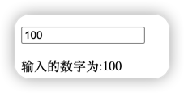
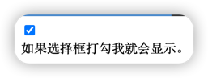

# 组件 - 自定义事件
父组件是使用 props 传递数据给子组件，但<font color=#dea32c>**如果子组件要把数据传递回去，就需要使用自定义事件**</font>！

我们可以<font color=#dea32c>**使用 v-on 绑定自定义事件**</font>, 每个 Vue 实例都实现了<font color=#dea32c>**事件接口(Events interface)**</font>，即：

* 使用 <font color=#dea32c>**$on(eventName)**</font> 监听事件
* 使用 <font color=#dea32c>**$emit(eventName)**</font> 触发事件

另外，父组件可以在使用子组件的地方直接用 v-on 来<font color=#dea32c>**监听子组件触发的事件**</font>。

> 以下实例中子组件已经和它外部完全解耦了。它所做的只是触发一个父组件关心的内部事件。
```html
<div id="app">
    <div id="counter-event-example">
      <p>{{ total }}</p>
      <button-counter v-on:increment="incrementTotal"></button-counter>
      <button-counter v-on:increment="incrementTotal"></button-counter>
    </div>
</div>
 
<script>
// 定义一个名为button-counter的组件
Vue.component('button-counter', {
  // 定义模板，模板中定义了按钮的文本显示以及点击  事件
  template: '<button v-on:click="incrementHandler">{{ counter }}</button>',
  // 定义数据，获取counter，data必须是函数
  data: function () {
    return {
      counter: 0
    }
  },
  methods: {
    // 定义方法incrementHandler
    incrementHandler: function () {
      this.counter += 1
      // 触发increment事件，类似于Invoke
      this.$emit('increment')
    }
  },
})
new Vue({
  el: '#counter-event-example',
  data: {
    total: 0
  },
  methods: {
    incrementTotal: function () {
      this.total += 1
    }
  }
})
</script>
```
[运行代码](code/自定义事件.html)

如果你想在某个组件的根元素上监听一个原生事件。可以使用 .native 修饰 v-on 。例如：
```html
<my-component v-on:click.native="doTheThing"></my-component>
```
#### data 必须是一个函数
上面例子中，可以看到 button-counter 组件中的 data 不是一个对象，而是一个函数：
```javascript
data: function() {
  return {
    count: 0
  }
}
```
这样的好处就是每个实例可以维护一份被返回对象的独立的拷贝，如果 data 是一个对象则会影响到其他实例，如下所示：
```html
<div id="components-demo3" class="demo">
    <button-counter2></button-counter2>
    <button-counter2></button-counter2>
    <button-counter2></button-counter2>
</div>
 
<script>
var buttonCounter2Data = {
  count: 0
}
Vue.component('button-counter2', {
    /*
    data: function () {
        // data 选项是一个函数，组件不相互影响
        return {
            count: 0
        }
    },
    */
    data: function () {
        // data 选项是一个对象，会影响到其他实例
        return buttonCounter2Data
    },
    template: '<button v-on:click="count++">点击了 {{ count }} 次。</button>'
})
new Vue({ el: '#components-demo3' })
</script>
```
[运行代码](code/自定义事件1.html)
***
### 自定义组件的 v-model
组件上的 v-model 默认会利用名为 <font color=#dea32c>**value**</font> 的 prop 和名为 <font color=#dea32c>**input**</font> 的事件。
```html
<input v-model="parentData">
```
等价于
```html
<input 
    :value="parentData"
    @input="parentData = $event.target.value"
>
```
> 以下实例自定义组件 runoob-input，父组件的 num 的初始值是 100，更改子组件的值能实时更新父组件的 num：
```html
<div id="app">
    <runoob-input v-model="num"></runoob-input>
    <p>输入的数字为:{{num}}</p>
</div>
<script>
Vue.component('runoob-input', {
    template: `
    <p>   <!-- 包含了名为 input 的事件 -->
      <input
       ref="input"
       :value="value" 
       @input="$emit('input', $event.target.value)"
      >
    </p>
    `,
    props: ['value'], // 名为 value 的 prop
})
   
new Vue({
    el: '#app',
    data: {
        num: 100,
    }
})
</script>
```


[运行代码](code/自定义事件2.html)

由于 v-model 默认传的是 value，不是 checked，所以<font color=#dea32c>**对于复选框或者单选框**</font>的组件时，我们需要使用 <font color=#dea32c>**model**</font> 选项，model 选项可以指定当前的事件类型和传入的 props。
```html
<div id="app">
    <base-checkbox v-model="lovingVue"></base-checkbox> 
     <div v-show="lovingVue"> 
        如果选择框打勾我就会显示。 
    </div>
</div> 
<script>
// 注册
Vue.component('base-checkbox', {
 
  model: {
    prop: 'checked',
    event: 'change'  // onchange 事件
  },
  props: {
    checked: Boolean
  },
   
  template: `
    <input
      type="checkbox"
      v-bind:checked="checked"
      v-on:change="$emit('change', $event.target.checked)"
    >
  `
})
// 创建根实例
new Vue({
  el: '#app',
  data: {
    lovingVue: true
  }
})
</script>
```


[运行代码](code/自定义事件3.html)

实例中 lovingVue 的值会传给 checked 的 prop，同时当 <base-checkbox> 触发 change 事件时， lovingVue 的值也会更新。