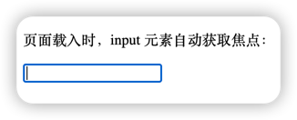

# 自定义指令
除了默认设置的<font color=#dea32c>**核心指令( v-model 和 v-show )**</font>, Vue 也允许<font color=#dea32c>**注册自定义指令**</font>。
> 下面我们注册一个全局指令 v-focus, 该指令的功能是在页面加载时，元素获得焦点：
```html
<div id="app">
    <p>页面载入时，input 元素自动获取焦点：</p>
    <input v-focus>
</div>
 
<script>
// 注册一个全局自定义指令 v-focus
Vue.directive('focus', {
  // 当绑定元素插入到 DOM 中。
  inserted: function (el) {
    // 聚焦元素
    el.focus()
  }
})
// 创建根实例
new Vue({
  el: '#app'
})
</script>
```


[运行代码](code/自定义指令.html)

我们也可以在实例使用 <font color=#dea32c>**directives**</font> 选项来<font color=#dea32c>**注册局部指令**</font>，这样指令只能在这个实例中使用：
```html
<div id="app">
  <p>页面载入时，input 元素自动获取焦点：</p>
  <input v-focus>
</div>
 
<script>
// 创建根实例
new Vue({
  el: '#app',
  directives: {
    // 注册一个局部的自定义指令 v-focus
    focus: {
      // 指令的定义
      inserted: function (el) {
        // 聚焦元素
        el.focus()
      }
    }
  }
})
</script>
```
[运行代码](code/自定义指令1.html)
***
## 钩子
### 钩子函数
指令定义函数提供了几个钩子函数（可选）：
> <font color=#dea32c>**bind**</font>: 只调用一次，指令第一次绑定到元素时调用，用这个钩子函数可以定义一个在绑定时执行一次的初始化动作。   
> 
> <font color=#dea32c>**inserted**</font>: 被绑定元素插入父节点时调用（父节点存在即可调用，不必存在于 document 中）。   
> 
> <font color=#dea32c>**update**</font>: 被绑定元素所在的模板更新时调用，而不论绑定值是否变化。通过比较更新前后的绑定值，可以忽略不必要的模板更新（详细的钩子函数参数见下）。 
> 
> <font color=#dea32c>**componentUpdated**</font>: 被绑定元素所在模板完成一次更新周期时调用。   
> 
> <font color=#dea32c>**unbind**</font>: 只调用一次， 指令与元素解绑时调用。   

### 钩子函数参数
> <font color=#dea32c>**el**</font>: 指令所绑定的元素，可以用来直接操作 DOM 。
> 
> <font color=#dea32c>**binding**</font>: 一个对象，包含以下属性：   
> * name: 指令名，不包括 v- 前缀。   
> * value: 指令的绑定值， 例如： v-my-directive="1 + 1", value 的值是 2。   
> * oldValue: 指令绑定的前一个值，仅在 update 和 componentUpdated 钩子中可用。无论值是否改变都可用。   
> * expression: 绑定值的表达式或变量名。 例如 v-my-directive="1 + 1" ， expression 的值是 "1 + 1"。   
> * arg: 传给指令的参数。例如 v-my-directive:foo， arg 的值是 "foo"。   
> * modifiers: 一个包含修饰符的对象。 例如： v-my-directive.foo.bar, 修饰符对象 modifiers 的值是 { foo: true, bar: true }。   
> 
> <font color=#dea32c>**vnode**</font>: Vue 编译生成的虚拟节点。   
> 
> <font color=#dea32c>**oldVnode**</font>: 上一个虚拟节点，仅在 update 和 componentUpdated 钩子中可用。   

> 以下实例演示了这些参数的使用：
```html
<div id="app"  v-runoob:hello.a.b="message">
</div>
 
<script>
Vue.directive('runoob', {
  bind: function (el, binding, vnode) {
    var s = JSON.stringify
    el.innerHTML =
      'name: '       + s(binding.name) + '<br>' +
      'value: '      + s(binding.value) + '<br>' +
      'expression: ' + s(binding.expression) + '<br>' +
      'argument: '   + s(binding.arg) + '<br>' +
      'modifiers: '  + s(binding.modifiers) + '<br>' +
      'vnode keys: ' + Object.keys(vnode).join(', ')
  }
})
new Vue({
  el: '#app',
  data: {
    message: 'vue2-菜鸟教程!'
  }
})
</script>
```


[运行代码](code/自定义指令2.html)

有时候我们不需要其他钩子函数，我们可以<font color=#dea32c>**简写函数**</font>，如下格式：
```javascript
Vue.directive('runoob', function (el, binding) {
  // 设置指令的背景颜色
  el.style.backgroundColor = binding.value.color
})
```
指令函数<font color=#dea32c>**可接受所有合法的 JavaScript 表达式**</font>，以下实例传入了 JavaScript 对象：
```html
<div id="app">
    <div v-runoob="{ color: 'green', text: '菜鸟教程!' }"></div>
</div>
 
<script>
Vue.directive('runoob', function (el, binding) {
    // 简写方式设置文本及背景颜色
    el.innerHTML = binding.value.text
    el.style.backgroundColor = binding.value.color
})
new Vue({
  el: '#app'
})
</script>
```


[运行代码](code/自定义指令3.html)