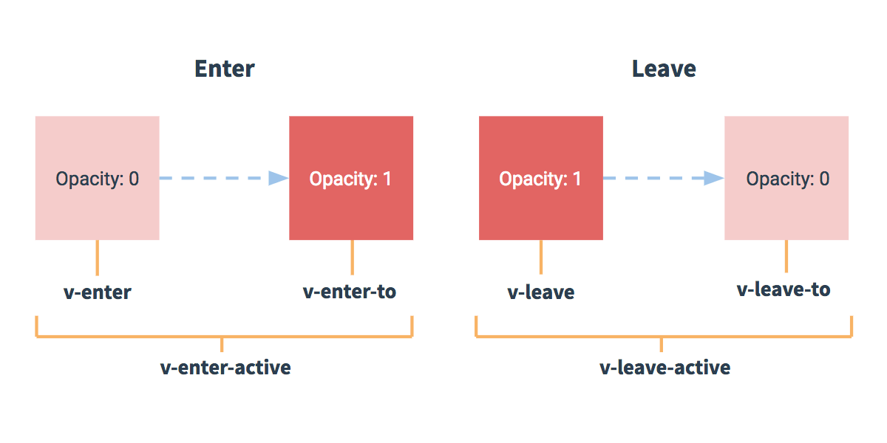

# 过渡 & 动画
## 过渡
Vue 在<font color=#dea32c>**插入、更新或者移除 DOM 时**</font>，提供多种不同方式的应用过渡效果。

Vue 提供了内置的过渡封装组件，该组件用于<font color=#dea32c>**包裹要实现过渡效果的组件**</font>。

### 语法格式
```html
<transition name = "name_of_transition">
    <!-- 包裹要实现过渡效果的组件 -->
   <div></div>
</transition>
```
### 案例
```html
<div id = "databinding">

    <!-- 通过点击 "点我" 按钮将变量 show 的值从 true 变为 false -->
    <button v-on:click = "show = !show">点我</button>
    
    <!-- 过渡是一个淡入淡出的效果 -->
    <transition name = "fade">
        <!-- 如果 show 为 true 则显示子元素 p 标签的内容 -->
        <p v-show = "show" v-bind:style = "styleobj">动画实例</p>
    </transition>
    
</div>

<script type = "text/javascript">
    var vm = new Vue({
    el: '#databinding',
        data: {
            show:true,
            styleobj :{
                fontSize:'30px',
                color:'red'
            }
        },
        methods : {
        }
    });
</script>
```
。。

下面这段代码展示了 transition 标签包裹了 p 标签：

[运行代码](code/过渡动画.html)

Vue在元素显示与隐藏的过渡中，提供了 6 个 class 来切换
> * <font color=#dea32c>**v-enter**</font>：定义进入过渡的开始状态。在元素被插入之前生效，在元素被插入之后的下一帧移除。
> 
> 
> * <font color=#dea32c>**v-enter-active**</font>：定义进入过渡生效时的状态。在整个进入过渡的阶段中应用，在元素被插入之前生效，在过渡/动画完成之后移除。这个类可以被用来定义进入过渡的过程时间，延迟和曲线函数。
> 
> 
> * <font color=#dea32c>**v-enter-to**</font>: 2.1.8版及以上 定义进入过渡的结束状态。在元素被插入之后下一帧生效 (与此同时 v-enter 被移除)，在过渡/动画完成之后移除。
> 
> 
> * <font color=#dea32c>**v-leave**</font>: 定义离开过渡的开始状态。在离开过渡被触发时立刻生效，下一帧被移除。
> 
> 
> * <font color=#dea32c>**v-leave-active**</font>：定义离开过渡生效时的状态。在整个离开过渡的阶段中应用，在离开过渡被触发时立刻生效，在过渡/动画完成之后移除。这个类可以被用来定义离开过渡的过程时间，延迟和曲线函数。
> 
> 
> * <font color=#dea32c>**v-leave-to**</font>: 2.1.8版及以上 定义离开过渡的结束状态。在离开过渡被触发之后下一帧生效 (与此同时 v-leave 被删除)，在过渡/动画完成之后移除。
>
> 
>
> 对于这些在过渡中切换的类名来说，如果你使用一个没有名字的 <transition>，则 v- 是这些类名的默认前缀。如果你使用了 <transition name="my-transition">，那么 v-enter 会替换为 my-transition-enter。
>
> v-enter-active 和 v-leave-active 可以控制进入/离开过渡的不同的缓和曲线，在下面章节会有个示例说明。

***

## CSS 过渡
```html
<div id = "databinding">
    
    <button v-on:click = "show = !show">点我</button>
    
    <transition name="slide-fade">
        <p v-if="show">hello</p>
    </transition>
    
</div>

<script type = "text/javascript">
    new Vue({
        el: '#databinding',
        data: {
            show: true
        }
    })
</script>
```
[运行代码](code/过渡动画1.html)

***

## CSS 动画
CSS 动画用法类似 CSS 过渡，但是在动画中 v-enter 类名在节点插入 DOM 后不会立即删除，而是在 animationend 事件触发时删除。
```html
<div id = "databinding">
    
    <button v-on:click = "show = !show">点我</button>
    
    <transition name="bounce">
        <p v-if="show">菜鸟教程 -- 学的不仅是技术，更是梦想！！！</p>
    </transition>
    
</div>

<script type = "text/javascript">
    new Vue({
        el: '#databinding',
        data: {
            show: true
        }
    })
</script>
```
[运行代码](code/过渡动画2.html)

***

## 自定义过渡的类名
可以通过以下特性来自定义过渡类名：
* enter-class
* enter-active-class
* enter-to-class (2.1.8+)
* leave-class
* leave-active-class
* leave-to-class (2.1.8+)

自定义过渡的类名优先级高于普通的类名，这样就能很好的与第三方（如：animate.css）的动画库结合使用。

```html
<div id = "databinding">
    
    <button v-on:click = "show = !show">点我</button>
    
    <transition
        name="custom-classes-transition"
        enter-active-class="animated tada"
        leave-active-class="animated bounceOutRight">
        
        <p v-if="show">
            菜鸟教程 -- 学的不仅是技术，更是梦想！！！
        </p>
        
    </transition>
    
</div>

<script type = "text/javascript">
    new Vue({
        el: '#databinding',
        data: {
            show: true
        }
    })
</script>
```
[运行代码](code/过渡动画3.html)
***

## 同时使用过渡和动画
Vue 为了知道过渡的完成，必须设置相应的<font color=#dea32c>**事件监听器**</font>。它可以是 transitionend 或 animationend ，这取决于给元素应用的 CSS 规则。如果你使用其中任何一种，Vue 能自动识别类型并设置监听。

但是，在一些场景中，你需要给同一个元素同时设置两种过渡动效，比如 animation 很快的被触发并完成了，而 transition 效果还没结束。在这种情况中，你就需要使用 <font color=#dea32c>**type**</font> 特性并设置 <font color=#dea32c>**animation**</font> 或 <font color=#dea32c>**transition**</font> 来明确声明你需要 Vue 监听的类型。

***
## 显性的过渡持续时间
在很多情况下，Vue 可以自动得出过渡效果的完成时机。默认情况下，Vue 会等待其在过渡效果的根元素的第一个 transitionend 或 animationend 事件。然而也可以不这样设定——比如，我们可以拥有一个精心编排的一系列过渡效果，其中一些嵌套的内部元素相比于过渡效果的根元素有延迟的或更长的过渡效果。

在这种情况下你可以用 <transition> 组件上的 duration 属性定制一个显性的过渡持续时间 (以毫秒计)：

```html
<transition :duration="1000">...</transition>
```

你也可以定制进入和移出的持续时间：

```html
<transition :duration="{ enter: 500, leave: 800 }">...</transition>
```

***
## JavaScript 钩子
可以在属性中声明 JavaScript 钩子:
### HTML 代码
```html
<transition
  v-on:before-enter="beforeEnter"
  v-on:enter="enter"
  v-on:after-enter="afterEnter"
  v-on:enter-cancelled="enterCancelled"
 
  v-on:before-leave="beforeLeave"
  v-on:leave="leave"
  v-on:after-leave="afterLeave"
  v-on:leave-cancelled="leaveCancelled"
>
  <!-- ... -->
</transition>
```
### JavaScript 代码
```javascript
// ...
methods: {
  // --------
  // 进入中
  // --------
 
  beforeEnter: function (el) {
    // ...
  },
  // 此回调函数是可选项的设置
  // 与 CSS 结合时使用
  enter: function (el, done) {
    // ...
    done()
  },
  afterEnter: function (el) {
    // ...
  },
  enterCancelled: function (el) {
    // ...
  },
 
  // --------
  // 离开时
  // --------
 
  beforeLeave: function (el) {
    // ...
  },
  // 此回调函数是可选项的设置
  // 与 CSS 结合时使用
  leave: function (el, done) {
    // ...
    done()
  },
  afterLeave: function (el) {
    // ...
  },
  // leaveCancelled 只用于 v-show 中
  leaveCancelled: function (el) {
    // ...
  }
}
```