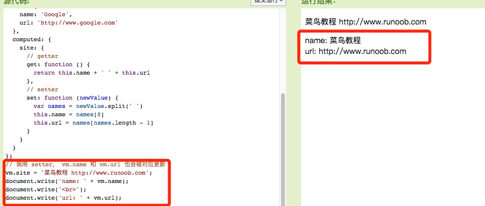

# 计算属性

1. 实例：反转字符串
2. computed vs methods
3. computed setter

关键词: <font color=#dea32c>**computed**</font>。

computed属性在处理一些复杂逻辑时是很有用的。


## 实例：反转字符串
```html
<div id="app">
  <p>原始字符串: {{ message }}</p>
  <p>计算后反转字符串: {{ reversedMessage }}</p>
</div>
 
<script>
var vm = new Vue({
  el: '#app',
  data: {
    message: 'Runoob!'
  },
  computed: {
    // 计算属性的 getter
    reversedMessage: function () {
      // `this` 指向 vm 实例
      return this.message.split('').reverse().join('')
    }
  }
})
</script>
```
[运行代码](code/计算属性.html)
***

## computed vs methods
可以使用 methods 来替代 computed，效果是一样的。

> computed: 是基于它的依赖缓存，只有相关依赖发生改变时才会重新取值。
> 
> methods: 在重新渲染的时候，函数总会重新调用执行。

使用 <font color=#dea32c>**computed 性能会更好**</font>，若不希望缓存，可以使用 methods 属性。

```html
methods: {
  reversedMessage2: function () {
    return this.message.split('').reverse().join('')
  }
}
```
***
## computed setter
computed属性默认只有getter，也可以提供一个setter ：

```html
var vm = new Vue({
  el: '#app',
  data: {
    name: 'Google',
    url: 'http://www.google.com'
  },
  computed: {
    site: {
      // getter
      get: function () {
        return this.name + ' ' + this.url
      },
      // setter
      set: function (newValue) {
        var names = newValue.split(' ')
        this.name = names[0]
        this.url = names[names.length - 1]
      }
    }
  }
})
// 调用 setter， vm.name 和 vm.url 也会被对应更新
vm.site = '菜鸟教程 http://www.runoob.com';
document.write('name: ' + vm.name);
document.write('<br>');
document.write('url: ' + vm.url);
```
[运行代码](code/计算属性1.html)

从实例运行结果看在运行 vm.site = '菜鸟教程 http://www.runoob.com'; 时，setter 会被调用， vm.name 和 vm.url 也会被对应更新。



