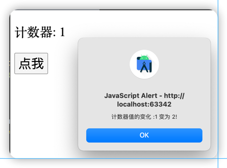

# 监听属性
通过 <font color=#dea32c>**watch**</font> 来<font color=#dea32c>**响应数据的变化**</font>。
```html
<div id = "app">
    <p >计数器: {{ counter }}</p>
    <!-- 点击按钮后counter自增1 -->
    <button @click = "counter++">点我</button>
</div>
```
```javascript
var vm = new Vue({
    el: '#app',
    data: {
        // counter初始值
        counter: 1
    }
});
// 监听变化
vm.$watch('counter', function(nval, oval) {
    alert('计数器值的变化 :' + oval + ' 变为 ' + nval + '!');
});
```


[运行代码](code/监听属性.html)
***
## 实例：千米与米的换算

[运行代码](code/监听属性1.html)
